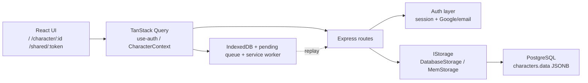

# Pocket Charlist — техническая документация

## 1. Обзор проекта

Pocket Charlist — full-stack SPA для ведения листов персонажей D&D 5e. Приложение ориентировано на русскоязычный интерфейс, мобильное использование, быстрые игровые действия и минимизацию ручных расчётов.

Ключевые сценарии:
- создание и ведение нескольких персонажей
- быстрый переход между edit/play режимами
- автокалькуляции характеристик, КД, HP, spell save DC и attack bonus
- броски кубов прямо из интерфейса
- экспорт, импорт и публичный шаринг персонажей
- единый аккаунт с входом через `email/password` и через Google

Для UI/UX-дизайнера ранее существовал `DESIGNER_PROJECT_GUIDE.md` — файл удалён как устаревший.

## 2. Быстрый вход



Короткая mental map системы:
- UI живёт в `client/` и держит пользовательское состояние через TanStack Query, `use-auth.ts` и `CharacterContext.tsx`.
- Все защищённые действия идут в Express routes из `server/routes.ts`.
- Аутентификация — cookie-based session auth. В production используется mixed auth через Google и `email/password`, в локальной разработке можно переключиться на bypass через `LOCAL_DEV`.
- Основная сущность персонажа хранится в таблице `characters`, но почти весь payload персонажа лежит внутри `characters.data` как JSONB.
- Частичная оффлайн-поддержка строится вокруг service worker, IndexedDB-кэша и очереди отложенных изменений.

Если нужно понять write path за 30 секунд, смотрите так:
1. UI вызывает `handleChange` или `saveChanges` в `CharacterContext`.
2. Клиент делает `PATCH /api/characters/:id` через `apiRequest`.
3. Сервер в `storage.updateCharacter()` читает текущего персонажа, делает `deepMerge`, затем пишет весь обновлённый JSONB обратно.
4. При оффлайне не-GET запрос может попасть в pending queue и быть отправлен позже.

## 3. Текущее состояние и ограничения

### Реализовано
- Смешанная авторизация: `email/password` + Google OAuth.
- Один аккаунт на один email.
- Account dialog для добавления или смены пароля.
- Публичный read-only шаринг персонажа.
- Библиотека заклинаний из `shared/data/spells_library.json` с фильтрами по уровню, школе и классу.
- `ConnectionStatus` смонтирован в `App.tsx`: отображает статус сети, счётчик pending changes и кнопку ручной синхронизации.
- Мобильное бургер-меню в шапке листа персонажа: экспорт PDF/JSON, шаринг, профиль и переключатель темы скрыты в `<Menu>` на маленьких экранах, на десктопе остаются открытыми кнопками.
- Частичная оффлайн-поддержка: service worker кэширует статику и «безопасные» GET-ответы, но **исключает** `/api/auth/*` и `/api/characters*` (user-specific данные — они живут в IndexedDB). При logout IndexedDB и pending-очередь очищаются.
- **Авторасчёт максимума ОЗ на 1-м уровне**: `calculateMaxHp(class, 1, conMod)` из `shared/types/character-types.ts`; поле `customMaxHpBonus` позволяет добавить ручной бонус. Со 2-го уровня — ручной ввод (игрок вносит результат броска кубика).
- **Авторасчёт КД по типу доспеха**: `calculateAC(dexMod, armor, shield, bonus)` с корректной обработкой тяжёлого доспеха (DEX игнорируется полностью, включая штраф).
- **Автосинхронизация ячеек заклинаний**: таблицы в `shared/data/spell-slots.ts`; `getSpellcastingProgression` собирает обычные spell slots, мультикласс и отдельный warlock pact magic по правилам D&D 5e. При изменении состава классов или уровней `SpellsSection` сразу применяет расчётные значения, а кнопка `По классу` остаётся ручным ресинком.
- **Кнопка повышения уровня по XP**: `getLevelFromXP` в `CharacterHeader`; кнопка появляется при накоплении XP, поддерживает прыжок сразу на несколько уровней.
- **`NumericInput`** (`client/src/components/ui/numeric-input.tsx`): управляемый числовой инпут с локальным state, позволяет очистить поле до нуля без немедленного сброса.
- **Rich text для длинных текстов**: `notes`, `appearance`, `allies`, `factions`, `feature.description` и `spell.description` хранятся как raw strings, но в UI рендерятся как Markdown + безопасный HTML; в edit-flow используется `Текст / Предпросмотр`. Каждое поле имеет кнопку разворота на полный экран (`Maximize2`) — открывает `ResponsiveDialog` с textarea на всю высоту и теми же табами.
- **Система снаряжения — скролл и жесты**: список предметов скроллируется внутри карточки (`max-height: min(60vh, 42rem)`). На мобиле — свайп влево открывает кнопки «Редактировать» (акцент) и «Удалить» (красный); длинный свайп (>65% ширины) сразу инициирует удаление. На десктопе — кнопки появляются при наведении. Удаление всегда требует подтверждения через `AlertDialog`. Редактирование предмета открывает `AddCustomItemDialog` с предзаполненными данными. Блок «Экипировано» отображается под всеми вкладками инвентаря, над полем денег; скрывается если экипированных предметов нет.
- **Экран загрузки**: двухуровневый loading screen — HTML pre-loader в `index.html` (рендерится до загрузки JS-бандла, включает определение темы из `localStorage`) и React-компонент `CharacterLoadingScreen` с теми же CSS-классами `.pkt-loader` для pixel-perfect перехода. `CharacterContext` учитывает `isAuthLoading` и не показывает «персонаж не найден» пока auth не завершился.
- **Система оружия — категории и свойства**: каждое оружие имеет `weaponCategory: "simple" | "martial" | "exotic"`. Все 35 оружий стандартной библиотеки размечены по категориям D&D 5e. `isWeaponProficient` принимает категорию и сравнивает с владениями «Простое оружие» / «Воинское оружие». Форма создания/редактирования оружия содержит chip-кнопки для 10 канонических свойств (Двуручное, Фехтовальное и др.) и Select для категории; при выборе «Фехтовальное» `abilityMod` автоматически переключается на DEX.
- **Отдых — короткий и долгий**: кнопки «Кор. отдых» и «Дол. отдых» в `CharacterHeader` (только в play-режиме). Короткий: трата костей хитов (d{X} + CON mod) с 500ms анимацией броска, пошаговый лог, восстановление HP. Долгий: полное восстановление HP, возврат половины максимума костей хитов (минимум 1), сброс всех spell slots и pact magic — с preview-карточками и `CheckCircle2` для уже заполненных ресурсов.
- **Аватарка персонажа**: в edit-режиме — карандаш-оверлей на аватарку открывает `AvatarPickerModal` (drag-and-drop + файловый диалог, круговой кроппер через `react-easy-crop`, сжатие до 256×256 JPEG). В play-режиме — клик открывает fullscreen-просмотр (`AvatarViewModal`). Хранится как base64 data URL в `character.avatar`.
- **Расовая система**: полный `RaceDefinition` shape для всех рас — id, source, entityType, speed, size, creatureType, traits, darkvision, resistances, spellGrants, skillChoices, abilityBonusSelection. Поддержка гибкого распределения расовых бонусов (MPMM линиджи, ревизии Таши): паттерны `+2/+1` или `+1/+1/+1` выбираются в Race Picker и сохраняются в `selectedRacialAbilityBonuses`. Расовые языки с placeholder «Один на выбор» резолвятся через `raceSelections["language-choices"]`.
- **Race Picker**: диалог выбора расы с поиском и мульти-фильтрами (источник, размер, тёмное зрение, тип линидж). Правая панель детального просмотра: описание, бонусы, трейты, заклинания, скорость, тёмное зрение, сопротивления, языки, подрасы.
- **Scroll-spy навигация на десктопе**: `useDesktopSectionNavigation` — ResizeObserver + rAF scroll-spy; scroll lock при программной прокрутке; поддержка `prefers-reduced-motion`; sticky offset рассчитывается по реальной высоте header и nav. Мобильный и десктопный layout используют общий `renderSection` с параметром `"mobile" | "desktop"`.
- **Сопротивления в ProficienciesSection**: расовые сопротивления к типам урона отображаются отдельным блоком (ShieldCheck + список типов на русском).

### Ограничения
- Нет email verification.
- Нет reset пароля по email.
- Оффлайн-поддержка best-effort: это не полностью завершённый offline-first режим.
- Versioning персонажей и server-side conflict detection отсутствуют.

## 4. Технологический стек

### Frontend
- React 18
- TypeScript
- Wouter
- TanStack Query v5
- Tailwind CSS
- Shadcn UI / Radix UI
- dnd-kit
- Framer Motion

### Backend
- Express 5
- TypeScript
- Drizzle ORM
- Zod
- Passport
- express-session
- connect-pg-simple

### Data / Infra
- PostgreSQL для production storage и sessions
- JSONB для хранения данных персонажа
- IndexedDB для локального кэша и очереди pending changes
- Service worker для кэширования статики и безопасных GET-ресурсов; `/api/auth/*` и `/api/characters*` намеренно исключены — они user-specific и кэшируются в IndexedDB

## 5. Архитектура и ключевые модули

### Основные страницы
- `/` — список персонажей для авторизованного пользователя или стартовый auth screen для гостя.
- `/character/:id` — основной экран персонажа.
- `/shared/:token` — публичная read-only версия персонажа.

### Основные клиентские точки
- `client/src/pages/CharactersList.tsx` — стартовая страница, список персонажей, import/create/delete, account dialog.
- `client/src/pages/CharacterSheet.tsx` — лист персонажа, шаринг, экспорт, edit/play flow, sticky-навигация по секциям `Общее -> Характеристики -> Оружие -> Инвентарь -> Заклинания -> Заметки` и rich-text notes-блок с preview в edit-mode.
- `client/src/context/CharacterContext.tsx` — загрузка персонажа, optimistic update, autosave, pending changes и share state.
- `client/src/hooks/use-auth.ts` — текущий пользователь, login/register/password/logout.
- `client/src/components/AuthScreen.tsx` — unified start screen для входа и регистрации.
- `client/src/components/AccountDialog.tsx` — установка первого пароля или смена существующего.
- `client/src/components/AbilityWithSkills.tsx` — карточка характеристики: модификатор, спасбросок (включая toggle профиценции и бросок), связанные навыки.
- `client/src/components/FeaturesList.tsx` — список способностей персонажа, раскрытие описаний и rich-text preview в диалоге создания.
- `client/src/components/SpellsSection.tsx` — spellcasting UI, реактивная синхронизация spell slots, библиотека заклинаний и rich-text preview/edit для описаний заклинаний.
- `client/src/components/AvatarPickerModal.tsx` — `AvatarPickerModal` (загрузка + кроппер) и `AvatarViewModal` (fullscreen-просмотр).
- `client/src/components/character-sheet/CharacterSheetDesktopNav.tsx` — sticky scroll-spy навбар для десктопного layout.
- `client/src/components/character-sheet/CharacterSheetMobileTabs.tsx` — нижняя таб-панель для мобильного layout с анимацией fade-in.
- `client/src/hooks/useDesktopSectionNavigation.ts` — хук scroll-spy навигации: ResizeObserver + rAF, scroll lock при программной прокрутке, `prefers-reduced-motion` support.
- `client/src/lib/weapons.ts` — типы и утилиты форм оружия: `WeaponCategory`, `WeaponFormValues` (с `properties: string[]`), `weaponPropsToArray` / `propsToString`, `isFinesseFromProps`.

### Основные серверные точки
- `server/routes.ts` — character/share endpoints и rate limits.
- `server/google-auth.ts` — production auth с mixed auth логикой.
- `server/local-auth.ts` — локальный auth bypass для разработки.
- `server/password.ts` — `scrypt`-хеширование, verify и normalizing email.
- `server/storage.ts` — `DatabaseStorage` и `MemStorage`.
- `server/deep-merge.ts` — merge логика для server-side PATCH.

### Shared-слой
- `shared/schema.ts` — таблица `characters` и реэкспорт shared types.
- `shared/models/auth.ts` — таблица `users`, auth user types.
- `shared/types/character-types.ts` — основная доменная модель персонажа, Zod-схемы, default character и расчётные функции; включая `getRacialBonuses`, `getValidatedSelectedRacialBonuses`, `createEmptyAbilityBonuses`.
- `shared/data/spells-library.ts` — нормализованная библиотека заклинаний из `shared/data/spells_library.json` (файл переехал из корня в `shared/data/`).
- `shared/data/race-types.ts` — канонические типы расовой системы: `RaceDefinition`, `RaceEntityType`, `RaceSourceCode`, `DamageType`, `RaceAbilityBonusSelection`, `RaceTrait`, `RaceSpellGrant`.
- `shared/data/d5e-races.ts` — расовые данные PHB в полном `RaceDefinition` shape; helper-функции `getRaceSpeed`, `getRaceCreatureType`, `getRaceResistances`.
- `shared/data/d5e-races-supplements.ts` — расы из дополнительных источников (VGM, MTF, TCE, MPMM, OGA, FTD, VRGtR): Аазимар, Варфорж, MPMM-линиджи (Дампир, Рейс, Обертос) и др.

## 6. Mental Model Character

Персонаж в этом проекте — не просто “JSONB blob”, а одна сущность с пятью зонами ответственности.

### 6.1 Пять зон модели

#### 1. Relational envelope
Это поля вокруг JSONB-записи в таблице `characters`:
- `id`
- `userId`
- `name`
- `shareToken`
- `isShared`
- `createdAt`
- `updatedAt`

Это отвечает за владение, шаринг, первичную идентификацию и метаданные хранения.

#### 2. Core build
Это “паспорт” и сборка персонажа внутри `characters.data`:
- `class`, `subclass`, `classes`
- `race`, `subrace`
- `raceRef` — стабильный slug расы (напр. `”tiefling-mpmm”`), backward-compatible
- `raceSource` — источник расы (`”PHB”` | `”MPMM”` | …)
- `raceSelections` — словарь выборов игрока внутри расовых способностей: `language-choices`, `skill-choices`, и т.д.
- `selectedRacialAbilityBonuses` — гибкое распределение расовых бонусов к характеристикам (для рас с `abilityBonusSelection`)
- `level`, `experience`
- `background`, `alignment`
- `abilityScores`, `customAbilityBonuses`
- `savingThrows`
- `skills`
- `proficiencies`

Именно здесь лежат ключевые игровые зависимости и большинство расчётов.

#### 3. Combat state
Это поля, которые чаще всего меняются во время игры:
- `armorClass`, `customACBonus`
- `initiative`, `customInitiativeBonus`
- `maxHp`, `currentHp`, `tempHp`
- `hitDice`, `hitDiceRemaining`
- `deathSaves`
- `spellcasting.spellSlots`

Это самый “горячий” слой данных с точки зрения autosave, оффлайна и конфликтов.

#### 4. Collections
Это массивы и списки, где выше всего риск ошибок при merge и импорте:
- `weapons`
- `equipment`
- `features`
- `spellcasting.spells`
- `classes`

Массивы особенно важны, потому что в PATCH они не merge-ятся поэлементно, а заменяются целиком.

#### 5. Private / freeform fields
Это поля со свободным пользовательским текстом, медиа и UI-lock состоянием:
- `notes`
- `appearance`
- `allies`
- `factions`
- `equipmentLocked`
- `weaponsLocked`
- `featuresLocked`
- `avatar` — base64 data URL аватарки (до ~30KB после сжатия 256×256 JPEG); пустая строка `""` означает «удалено»

Текстовые поля хранятся как обычные строки, readonly/shared UI рендерит их как Markdown + безопасный HTML.
`avatar` хранится прямо в JSONB-документе персонажа — отдельного файлового storage нет.
Здесь меньше расчётной логики, но больше риска утечки в public-view и потери данных при неаккуратных изменениях allowlist-модели.

### 6.2 Что меняется чаще всего

Во время реальной игры чаще всего меняются:
- `currentHp`
- `tempHp`
- `deathSaves`
- `spellcasting.spellSlots`
- подготовка заклинаний и состав `spellcasting.spells`
- быстрые toggles вроде lock-полей и share state

Именно эти поля первыми попадают под autosave, optimistic update и оффлайн-очередь.

### 6.3 Какие поля критичны и связаны между собой

Наиболее связанные и чувствительные зоны:
- `class` и `classes`
- `level` и `classes`
- `abilityScores`, `customAbilityBonuses` и производные модификаторы
- `savingThrows` и класс-профиценции
- `maxHp`, `currentHp`, `hitDice`, `hitDiceRemaining`
- `spellcasting.ability`, `spellcasting.spells`, `spellcasting.spellSlots`
- `shareToken`, `isShared` и публичная проекция персонажа

Если менять такие поля в изоляции, легко получить валидный JSON с неконсистентным игровым смыслом.

### 6.4 Где чаще всего появляются баги

Самые частые bug-prone зоны:
- массивы объектов, потому что PATCH заменяет их целиком
- связанные поля сборки персонажа, когда меняется одно поле без вторичного пересчёта или синхронизации
- импорт внешнего JSON, где структура частично грязная, неполная или нестандартная
- расхождение private/public модели, если новые поля не учтены в `publicCharacterSchema`
- расхождение клиентского optimistic merge и итогового server merge

## 7. Модель данных

### Таблица `users`
Определена в `shared/models/auth.ts`.

Поля:
- `id`
- `email`
- `googleId`
- `passwordHash`
- `firstName`
- `lastName`
- `profileImageUrl`
- `createdAt`
- `updatedAt`

Важно:
- `id` — внутренний app user id.
- Для новых пользователей Google `profile.id` не используется как primary key.
- При старте production auth выполняется runtime-backfill старых Google-only пользователей: `googleId = id`, если у записи нет `passwordHash`.

### Таблица `characters`
Определена в `shared/schema.ts`.

Поля:
- `id`
- `userId`
- `name`
- `data` (`jsonb`)
- `shareToken`
- `isShared`
- `createdAt`
- `updatedAt`

Индексы:
- `characters_user_id_idx` на `userId` — покрывает все запросы персонажей пользователя
- `characters_share_token_idx` на `shareToken` — покрывает публичный shared lookup

Практический смысл:
- relational envelope лежит в колонках таблицы
- полная игровая модель лежит в `data`
- `updatedAt` обновляется в БД, но не используется как concurrency token и не участвует в optimistic locking

Индексы (определены в `shared/schema.ts`):
- `characters_user_id_idx` на `userId` — ускоряет `getCharacters(userId)` и `getCharacter(id, userId)`
- `characters_share_token_idx` на `shareToken` — ускоряет `getCharacterByShareToken(token)`

### Публичная модель персонажа
`publicCharacterSchema` определена в `shared/types/character-types.ts`.

Из публичного ответа исключаются:
- `userId`

`notes` теперь входит в shared/read-only payload наравне с `appearance`, `allies` и `factions`.
`GET /api/shared/:token` использует allowlist-подход: наружу возвращается только разрешённый набор полей. Если в модель персонажа добавляется новое приватное поле, его нужно явно учесть в публичной схеме.

### Ответ `GET /api/auth/user`
Сервер отдаёт безопасную форму пользователя:
- `id`
- `email`
- `firstName`
- `lastName`
- `profileImageUrl`
- `createdAt`
- `updatedAt`
- `hasPassword`
- `hasGoogle`

## 8. Аутентификация и аккаунты

### Общий подход
Проект использует cookie-based session auth. В production доступны два способа входа:
- Google OAuth
- `email/password`

Оба способа работают поверх одной пользовательской записи.

### Auth behavior
- Один email = один аккаунт.
- Если локальный пользователь уже существует по email и входит через Google, `googleId` привязывается к этой же записи.
- Если аккаунт создан через Google и не имеет `passwordHash`, пароль можно поставить только из уже авторизованного состояния.
- Регистрация не должна анонимно “перехватывать” существующий Google-only аккаунт.

### UI-поведение
- Гость попадает на `AuthScreen` на `/`.
- На стартовом экране есть табы “Вход” и “Регистрация”.
- Кнопка Google остаётся альтернативным способом входа.
- Управление паролем происходит через `AccountDialog`.
- При `401` клиент возвращает пользователя на `/`, а не форсит новый Google-flow.

### LOCAL_DEV
`LOCAL_DEV` переключает только auth-режим:
- production auth отключается
- сервер использует `local-auth.ts`
- `/api/auth/user` возвращает фиктивного локального пользователя

Storage при этом выбирается отдельно:
- если есть `DATABASE_URL`, используется PostgreSQL
- если `DATABASE_URL` нет, используется `MemStorage`

### Безопасность
- Auth endpoints имеют отдельный IP-based rate limit: 10 попыток за 15 минут.
- Пароли хранятся как salted hash через встроенный `crypto.scrypt` (16-byte random salt, `timingSafeEqual` при verify).
- Email нормализуется как `trim().toLowerCase()`.
- Session cookie использует `sameSite: "lax"` (не `strict`) — это критично для Google OAuth: после callback Google возвращает браузер cross-site-редиректом, и с `strict` cookie не прилетает в обратный запрос, сессия не открывается.
- Logout работает через `POST /api/logout` (ранее был GET) — предотвращает CSRF-выход через ссылку или redirect от третьей стороны.
- CORS настраивается через `ALLOWED_ORIGIN` env var; без него — same-origin only (безопасно для single-server deploy).
- `ensureUserAuthColumns()` удалена: runtime ALTER TABLE больше не выполняется при каждом старте сервера. Нужные колонки уже существуют в Drizzle-схеме. `backfillLegacyGoogleUsers()` оставлена — она идемпотентна и нужна для легаси Google-only пользователей.

Критичные mixed auth edge cases описаны отдельно в разделе 14.

## 9. API reference

### Общие правила
- Все character endpoints и приватные auth endpoints работают с cookie-based session auth.
- Публичным без логина является только `GET /api/shared/:token`, а также редиректные Google endpoints.
- Character endpoints ограничены rate limit-ом `120 req/min` на пользователя.
- Public shared endpoint ограничен rate limit-ом `30 req/min` по IP.
- Auth endpoints ограничены rate limit-ом `10 попыток / 15 минут` по IP.
- `PATCH /api/characters/:id` возвращает полный `Character`, а не diff.
- `DELETE /api/characters/:id` возвращает `204 No Content`.

### 9.1 Персонажи

#### `GET /api/characters`
- Auth: да
- Возвращает: массив полных `Character`
- Основные статусы: `200`, `401`, `429`

Пример ответа:
```json
[
  {
    "id": "2fcd6a8e-0d24-45f0-90f9-f3c72f0f4fb1",
    "userId": "user_123",
    "name": "Новый персонаж",
    "class": "Воин",
    "race": "Человек",
    "level": 1,
    "currentHp": 10,
    "maxHp": 10
  }
]
```

#### `GET /api/characters/:id`
- Auth: да
- Возвращает: полный `Character` текущего пользователя
- Основные статусы: `200`, `401`, `404`, `429`

Пример ответа:
```json
{
  "id": "2fcd6a8e-0d24-45f0-90f9-f3c72f0f4fb1",
  "userId": "user_123",
  "name": "Новый персонаж",
  "class": "Воин",
  "classes": [
    { "name": "Воин", "level": 1 }
  ],
  "race": "Человек",
  "level": 1,
  "abilityScores": {
    "STR": 10,
    "DEX": 10,
    "CON": 10,
    "INT": 10,
    "WIS": 10,
    "CHA": 10
  },
  "currentHp": 10,
  "maxHp": 10,
  "deathSaves": {
    "successes": 0,
    "failures": 0
  },
  "weapons": [],
  "equipment": []
}
```

#### `POST /api/characters`
- Auth: да
- Request body: объект, проходящий `insertCharacterSchema`
- Возвращает: созданный полный `Character`
- Основные статусы: `201`, `400`, `401`, `429`

Практическое правило:
- Для интеграций безопаснее стартовать с payload, эквивалентным `createDefaultCharacter()`, а не пытаться собирать “пустой” персонаж вручную.

Пример рабочего payload:
```json
{
  "name": "Новый персонаж",
  "class": "Воин",
  "race": "Человек",
  "level": 1,
  "classes": [
    { "name": "Воин", "level": 1 }
  ],
  "background": "",
  "alignment": "Истинно нейтральный",
  "experience": 0,
  "abilityScores": {
    "STR": 10,
    "DEX": 10,
    "CON": 10,
    "INT": 10,
    "WIS": 10,
    "CHA": 10
  },
  "customAbilityBonuses": {
    "STR": 0,
    "DEX": 0,
    "CON": 0,
    "INT": 0,
    "WIS": 0,
    "CHA": 0
  },
  "savingThrows": {
    "STR": true,
    "DEX": false,
    "CON": true,
    "INT": false,
    "WIS": false,
    "CHA": false
  },
  "skills": {
    "Акробатика": { "proficient": false, "expertise": false },
    "Анализ": { "proficient": false, "expertise": false },
    "Атлетика": { "proficient": false, "expertise": false },
    "Восприятие": { "proficient": false, "expertise": false },
    "Выживание": { "proficient": false, "expertise": false },
    "Выступление": { "proficient": false, "expertise": false },
    "Запугивание": { "proficient": false, "expertise": false },
    "История": { "proficient": false, "expertise": false },
    "Ловкость рук": { "proficient": false, "expertise": false },
    "Магия": { "proficient": false, "expertise": false },
    "Медицина": { "proficient": false, "expertise": false },
    "Обман": { "proficient": false, "expertise": false },
    "Природа": { "proficient": false, "expertise": false },
    "Проницательность": { "proficient": false, "expertise": false },
    "Религия": { "proficient": false, "expertise": false },
    "Скрытность": { "proficient": false, "expertise": false },
    "Убеждение": { "proficient": false, "expertise": false },
    "Уход за животными": { "proficient": false, "expertise": false }
  },
  "armorClass": 10,
  "customACBonus": 0,
  "initiative": 0,
  "customInitiativeBonus": 0,
  "speed": 30,
  "maxHp": 10,
  "currentHp": 10,
  "tempHp": 0,
  "hitDice": "1d10",
  "hitDiceRemaining": 1,
  "deathSaves": {
    "successes": 0,
    "failures": 0
  },
  "weapons": [],
  "features": [],
  "equipment": [],
  "money": {
    "cp": 0,
    "sp": 0,
    "ep": 0,
    "gp": 0,
    "pp": 0
  },
  "proficiencies": {
    "languages": ["Общий"],
    "weapons": [],
    "armor": [],
    "tools": []
  },
  "proficiencyBonus": 2,
  "notes": "",
  "appearance": "",
  "allies": "",
  "factions": "",
  "equipmentLocked": false,
  "weaponsLocked": false,
  "featuresLocked": false
}
```

Пример ответа:
```json
{
  "id": "2fcd6a8e-0d24-45f0-90f9-f3c72f0f4fb1",
  "userId": "user_123",
  "name": "Новый персонаж",
  "class": "Воин",
  "race": "Человек",
  "level": 1,
  "currentHp": 10,
  "maxHp": 10
}
```

#### `PATCH /api/characters/:id`
- Auth: да
- Request body: частичный `Character`
- Возвращает: полный `Character`
- Основные статусы: `200`, `401`, `404`, `429`

Пример 1. Простое scalar-обновление:
```http
PATCH /api/characters/2fcd6a8e-0d24-45f0-90f9-f3c72f0f4fb1
Content-Type: application/json
```

```json
{
  "currentHp": 12
}
```

Пример 2. Вложенное object-обновление:
```json
{
  "deathSaves": {
    "failures": 1
  }
}
```

Пример 3. Обновление массива:
```json
{
  "weapons": [
    {
      "id": "weapon-longsword",
      "name": "Длинный меч",
      "attackBonus": 5,
      "damage": "1d8",
      "damageType": "рубящий",
      "abilityMod": "str",
      "properties": "универсальное (1d10)"
    }
  ]
}
```

Важно:
- массивы заменяются целиком, а не merge-ятся по элементам
- если нужно изменить один объект в массиве, клиент должен отправить весь новый массив

Фрагмент успешного ответа:
```json
{
  "id": "2fcd6a8e-0d24-45f0-90f9-f3c72f0f4fb1",
  "userId": "user_123",
  "currentHp": 12,
  "deathSaves": {
    "successes": 0,
    "failures": 1
  },
  "weapons": [
    {
      "id": "weapon-longsword",
      "name": "Длинный меч",
      "attackBonus": 5,
      "damage": "1d8",
      "damageType": "рубящий",
      "abilityMod": "str",
      "properties": "универсальное (1d10)"
    }
  ]
}
```

#### `DELETE /api/characters/:id`
- Auth: да
- Возвращает: пустое тело
- Основные статусы: `204`, `401`, `404`, `429`

Пример:
```http
DELETE /api/characters/2fcd6a8e-0d24-45f0-90f9-f3c72f0f4fb1
```

Успешный ответ:
- `204 No Content`

### 9.2 Шаринг

#### `GET /api/characters/:id/share`
- Auth: да
- Возвращает: текущий share state персонажа
- Основные статусы: `200`, `401`, `404`, `429`

Пример ответа:
```json
{
  "shareToken": "78e8b635-3d93-4a7a-813d-6dc3970ce4a8",
  "isShared": true
}
```

#### `POST /api/characters/:id/share`
- Auth: да
- Возвращает: новый или существующий `shareToken`
- Основные статусы: `200`, `401`, `404`, `429`

Пример ответа:
```json
{
  "shareToken": "78e8b635-3d93-4a7a-813d-6dc3970ce4a8"
}
```

#### `DELETE /api/characters/:id/share`
- Auth: да
- Возвращает: отключённый share state
- Основные статусы: `200`, `401`, `404`, `429`

Пример ответа:
```json
{
  "isShared": false,
  "shareToken": null
}
```

#### `GET /api/shared/:token`
- Auth: нет
- Возвращает: публичную read-only проекцию персонажа
- Основные статусы: `200`, `404`, `429`

Важно:
- ответ режется через `publicCharacterSchema`
- `userId` наружу не отдаётся, а `notes` теперь доступны в shared read-only ответе

Фрагмент ответа:
```json
{
  "id": "2fcd6a8e-0d24-45f0-90f9-f3c72f0f4fb1",
  "name": "Новый персонаж",
  "class": "Воин",
  "race": "Человек",
  "level": 1,
  "currentHp": 10,
  "maxHp": 10,
  "appearance": "",
  "allies": "",
  "factions": ""
}
```

### 9.3 Аутентификация

#### `GET /api/auth/user`
- Auth: да
- Возвращает: безопасную форму текущего пользователя
- Основные статусы: `200`, `401`

Пример ответа:
```json
{
  "id": "user_123",
  "email": "player@example.com",
  "firstName": "Илья",
  "lastName": "Игроков",
  "profileImageUrl": "https://lh3.googleusercontent.com/example",
  "createdAt": "2026-03-31T12:00:00.000Z",
  "updatedAt": "2026-03-31T12:00:00.000Z",
  "hasPassword": true,
  "hasGoogle": true
}
```

#### `POST /api/auth/register`
- Auth: нет
- Request body: `email`, `password`, опционально `confirmPassword`
- Возвращает: безопасную форму пользователя и сразу открывает сессию
- Основные статусы: `201`, `400`, `409`, `429`

Пример запроса:
```json
{
  "email": "player@example.com",
  "password": "strong-password-123",
  "confirmPassword": "strong-password-123"
}
```

Пример ответа:
```json
{
  "id": "user_123",
  "email": "player@example.com",
  "firstName": null,
  "lastName": null,
  "profileImageUrl": null,
  "createdAt": "2026-03-31T12:00:00.000Z",
  "updatedAt": "2026-03-31T12:00:00.000Z",
  "hasPassword": true,
  "hasGoogle": false
}
```

Типовой `409`:
- email уже существует
- email уже принадлежит Google-only аккаунту, куда пароль нельзя добавить анонимно

#### `POST /api/auth/login`
- Auth: нет
- Request body: `email`, `password`
- Возвращает: безопасную форму пользователя и открывает сессию
- Основные статусы: `200`, `400`, `401`, `429`

Пример запроса:
```json
{
  "email": "player@example.com",
  "password": "strong-password-123"
}
```

Пример ответа:
```json
{
  "id": "user_123",
  "email": "player@example.com",
  "firstName": "Илья",
  "lastName": "Игроков",
  "profileImageUrl": null,
  "createdAt": "2026-03-31T12:00:00.000Z",
  "updatedAt": "2026-03-31T12:00:00.000Z",
  "hasPassword": true,
  "hasGoogle": false
}
```

Типовой `401`:
- неверный email или пароль
- аккаунт существует только через Google и не имеет локального пароля

#### `POST /api/auth/password`
- Auth: да
- Request body:
  - для Google-only аккаунта без пароля: только `newPassword`
  - для пользователя с существующим паролем: `currentPassword` + `newPassword`
- Возвращает: обновлённую безопасную форму пользователя
- Основные статусы: `200`, `400`, `401`, `404`, `429`

Пример 1. Установить первый пароль:
```json
{
  "newPassword": "strong-password-123"
}
```

Пример 2. Сменить существующий пароль:
```json
{
  "currentPassword": "old-password-123",
  "newPassword": "new-password-456"
}
```

Пример ответа:
```json
{
  "id": "user_123",
  "email": "player@example.com",
  "firstName": "Илья",
  "lastName": "Игроков",
  "profileImageUrl": "https://lh3.googleusercontent.com/example",
  "createdAt": "2026-03-31T12:00:00.000Z",
  "updatedAt": "2026-03-31T12:05:00.000Z",
  "hasPassword": true,
  "hasGoogle": true
}
```

#### `GET /api/login`
- Auth: нет
- Поведение: запускает Google OAuth flow

#### `GET /api/callback`
- Auth: нет
- Поведение: завершает Google OAuth и редиректит на `/`

#### `POST /api/logout`
- Auth: да
- Поведение: завершает сессию, возвращает `{ "ok": true }`
- Клиент (в `use-auth.ts`) после успешного logout синхронно очищает TanStack Query cache, IndexedDB-кэш персонажей и pending queue, затем делает `window.location.href = "/"`
- Основные статусы: `200`, `401`

### 9.4 Поведение неавторизованных запросов
- Защищённые endpoints отвечают `401`.
- Клиент больше не форсит пользователя сразу в Google-flow.
- При `401` пользовательский flow возвращает на стартовый экран `/`.

## 10. Conflict Resolution and Consistency Model

Это критичный operational-раздел: в проекте нет отдельной conflict subsystem, поэтому поведение нужно понимать ровно так, как оно реализовано сейчас.

### 10.1 Что есть сейчас
- Versioning персонажей отсутствует.
- Optimistic locking отсутствует.
- ETag / `If-Match` отсутствуют.
- Сервер не хранит и не сравнивает revision number персонажа.
- `updatedAt` в таблице обновляется, но не участвует в принятии решений о конфликте.

### 10.2 Как реально работает `PATCH`

Server path:
1. `routes.ts`: `characterSchema.partial().parse(req.body)` — неизвестные поля отсекаются, типы валидируются. При ошибке — `400 { error }`.
2. `storage.updateCharacter()` загружает текущего персонажа по `id + userId`.
3. Из payload удаляются `id` и `userId`.
4. Выполняется `deepMerge(existing, validatedData)`.
5. Результат merge прогоняется через `characterSchema.safeParse()`. При провале — предупреждение в лог; запись продолжается с исходным merged-результатом (безопасный fallback).
6. В БД записывается весь обновлённый JSONB, а не patch/diff.

### 10.3 Правила merge
- Plain objects merge-ятся рекурсивно.
- Массивы не merge-ятся поэлементно и не diff-ятся.
- Если в payload пришёл массив, он заменяет весь старый массив.
- `undefined` на сервере игнорируется.
- `null` на сервере перезаписывает существующее значение.

Практическое следствие:
- `PATCH { "deathSaves": { "failures": 1 } }` сохранит `deathSaves.successes`, если оно уже было.
- `PATCH { "weapons": [...] }` заменит весь список оружия, даже если менялся только один элемент.

### 10.4 Кто побеждает при конфликте

Текущее правило конфликта:
- побеждает последний успешно сохранённый запрос

Это означает:
- если два клиента редактируют одни и те же scalar-поля, победит тот PATCH, который сервер применил последним
- если один клиент отправляет старый массив, он может затереть более свежие изменения другого клиента
- сервер не пытается определить “чей state новее” и не делает semantic merge

### 10.5 Оффлайн-реплей и конфликты

Pending queue не делает reconcile/rebase:
- queued change повторно отправляется как обычный HTTP-запрос
- он не знает, что серверное состояние могло уже измениться после момента постановки в очередь
- если queued PATCH содержит затрагиваемые поля, он может переехать поверх более поздних серверных изменений

Точное поведение replay в `offline-sync.ts`:
- изменения отправляются последовательно
- успешные ответы и `404` удаляются из очереди
- `4xx/5xx` остаются в очереди как failed
- network exception прерывает текущий проход синка

### 10.6 Важный caveat: клиентский merge не идентичен серверному

В `CharacterContext.tsx` клиентский optimistic `deepMerge` отличается от server-side версии:
- клиент не пропускает `undefined`
- сервер пропускает `undefined`

Редкий, но важный operational эффект:
- UI может временно показать optimistic state, который потом не совпадёт с фактически сохранённым серверным результатом

Если нужно расследовать “на экране было одно, после перезагрузки стало другое”, это одна из первых точек для проверки.

**Смягчение:** `updateMutation.onSuccess` записывает полный серверный ответ в `queryClient.setQueryData([“/api/characters”, id], ...)`, а `onSettled` делает `invalidateQueries({ queryKey: [“/api/characters”] })`. Это означает, что расхождение optimistic→server компенсируется сразу после завершения запроса, не ждёт следующей manual refetch. Аналогично работают `enableShareMutation` и `disableShareMutation`.

## 11. Заклинания

### Источник библиотеки
Библиотека заклинаний собрана в `shared/data/spells_library.json` и подключена через `shared/data/spells-library.ts`.

Нормализованные поля записи библиотеки:
- `id`
- `name`
- `level`
- `school`
- `classes`
- `range`
- `ritual`
- `components`
- `castingTime`
- `description`
- `concentration`
- `duration`

### UI-поведение
В `SpellsSection.tsx` доступны:
- spellcasting ability
- spell save DC
- spell attack bonus
- слоты 1–9 уровня
- реактивная синхронизация расчётных слотов при смене классов и уровней
- ручной ресинк через кнопку `По классу` и точечные `/{расч.}` подсказки
- список заклинаний персонажа
- ручное создание и редактирование заклинаний
- rich-text preview для описаний заклинаний в create/edit диалогах
- rich rendering описаний в раскрытых spell cards
- библиотека заклинаний

### Поиск в библиотеке
Поддерживается фильтрация:
- по названию
- по уровню
- по школе
- по классу (выпадающий список, использует поле `classes` из SpellEntry)

## 12. Оффлайн-поддержка

### Что реально есть
- `client/public/sw.js` регистрируется в production через `client/src/main.tsx`.
- Service worker кэширует (версия `pocket-charlist-v2`):
  - `/` и `/index.html`
  - статические ресурсы (JS, CSS, шрифты, картинки)
  - успешные GET-ответы API — **кроме `/api/auth/*` и `/api/characters*`**: эти маршруты user-specific и в SW-кэш не попадают, чтобы не дать одному пользователю увидеть кэш другого при разделении браузера
- User-specific данные персонажей живут исключительно в IndexedDB (`offline-db.ts`)
- `client/src/lib/offline-db.ts` использует IndexedDB для:
  - кэша персонажей
  - очереди pending changes
- `client/src/lib/queryClient.ts`:
  - кэширует список и отдельные карточки персонажей
  - при оффлайне читает данные из IndexedDB
  - для не-GET запросов может класть изменения в очередь
- `client/src/lib/offline-sync.ts` умеет повторно отправлять queued changes

### Чего сейчас нет в основном UI
- Нет полного conflict-aware UX для queued changes.
- Нет полноценного diff/review шага перед replay отложенных PATCH-запросов.

Итоговая формулировка:
- проект имеет частичную оффлайн-поддержку
- проект не является полностью завершённым offline-first приложением
- детали merge и конфликтов нужно читать вместе с разделом 10

Критичные риски очереди и replay описаны отдельно в разделе 14.

## 13. Импорт, экспорт и шаринг

### Импорт
- Поддерживается импорт JSON-персонажей.
- Основной импортёр находится в `client/src/lib/lss-import.ts`.
- Импортёр распознаёт несколько форматов через эвристики, включая pocket-charlist и Long Story Short JSON.
- При импорте возможны lossy mappings: внешние поля не всегда один в один совпадают с внутренней моделью.

Критичные import edge cases описаны отдельно в разделе 14.

### Экспорт
- JSON export — `client/src/lib/json-export.ts`
- PDF export — `client/src/lib/pdf-export.ts`
- PDF export теперь template-driven и работает только через AcroForm: exporter загружает `client/public/charlist_blank.pdf`, встраивает Unicode-шрифт из `client/public/fonts/NotoSans-Regular.ttf`, находит именованные поля формы и заполняет их через `pdf-lib`.
- `assets/charlist_blank.pdf` — source-of-truth шаблон для ручной разметки и обновления полей. `client/public/charlist_blank.pdf` используется рантаймом в браузере (доставляется через Vite public).
- PDF-экспорт не расширяет `Character`-схему: поля шаблона без источника в текущей модели (`имя игрока`, `черты характера`, `идеалы`, `привязанности`, `слабости`, `возраст`, `рост`, `вес`, `глаза`, `кожа`, `волосы`, `символ`, `сокровища`) остаются пустыми.
- `appearance`, `notes`, `allies` и `factions` перед экспортом нормализуются в plain text: Markdown/HTML убираются до читаемого текста, а `factions` сворачиваются в тот же блок, что и `союзники и организации`, потому что в шаблоне нет отдельной секции под фракции.
- Экспорт дополнительно объединяет ручные и автоматические владения расы/класса, выводит заклинательную характеристику русскими сокращениями и адаптивно уменьшает шрифт в длинных AcroForm-полях до нижней границы `6pt`.

### Шаринг
- В `CharacterSheet` пользователь может включить шаринг.
- Появляется публичная ссылка на `/shared/:token`.
- Публичная страница read-only и не требует авторизации.
- Ответ режется allowlist-моделью `publicCharacterSchema`.

## 14. Known Risk Areas

### Deep merge + concurrent edits
- Почему это риск:
  - система не использует versioning и не определяет конкурентные конфликты
  - массивы заменяются целиком
  - связанные поля персонажа могут обновляться из разных UI-path одновременно
- Как это выглядит в симптомах:
  - “одно поле сохранилось, а соседнее откатилось”
  - “после второй вкладки пропал элемент из массива”
  - “в UI всё выглядело правильно, после перезагрузки стало иначе”
- Текущее реальное поведение:
  - last successful write wins
  - server `PATCH` делает recursive merge только для plain objects
  - arrays replace whole arrays
  - `undefined` игнорируется на сервере
- Где искать код:
  - `server/deep-merge.ts`
  - `server/storage.ts`
  - `client/src/context/CharacterContext.tsx`
- Что нельзя сломать:
  - запрет на перезапись `id/userId` через PATCH
  - понимание, что `PATCH` возвращает полный `Character`
  - distinction между server merge и client optimistic merge

### Offline queue sync conflicts
- Почему это риск:
  - queued changes могут быть построены на устаревшем локальном состоянии
  - replay не делает rebase на текущее серверное состояние
  - пользователь не видит conflict review step в основном UI
- Как это выглядит в симптомах:
  - после восстановления сети часть изменений “вернулась”, а часть затёрла более свежие данные
  - один неудачный replay оставляет элементы в очереди и даёт повторяющиеся проблемы
  - расследование требует понимания, что именно было в pending queue
- Текущее реальное поведение:
  - изменения уходят последовательно
  - `2xx` и `404` удаляются из очереди
  - `4xx/5xx` остаются в очереди
  - network exception прерывает текущий проход
- Где искать код:
  - `client/src/lib/queryClient.ts`
  - `client/src/lib/offline-db.ts`
  - `client/src/lib/offline-sync.ts`
  - `client/public/sw.js`
- Что нельзя сломать:
  - кэш GET-ответов отдельно от очереди write-запросов
  - semantics удаления очереди только после успешного replay или `404`
  - связь с разделом 10 про отсутствие conflict resolution

### Import mapping edge cases
- Почему это риск:
  - импорт использует эвристики распознавания формата
  - внешние JSON-структуры могут быть неполными, грязными или неожиданно закодированными
  - часть полей маппится с потерями или через fallback
- Как это выглядит в симптомах:
  - некорректные skill names
  - неполный инвентарь или feature list после импорта
  - странные символы или missing data в текстовых полях
- Текущее реальное поведение:
  - поддерживается pocket-charlist JSON и LSS-подобный JSON
  - формат определяется эвристически
  - при неизвестном формате импортёр кидает ошибку
  - для части полей используются запасные значения по умолчанию
- Где искать код:
  - `client/src/lib/lss-import.ts`
  - `shared/types/character-types.ts`
- Что нельзя сломать:
  - поддержка текущих форматов импорта
  - fallback values для критичных полей персонажа
  - явная ошибка на действительно неизвестном формате

### Mixed auth edge cases
- Почему это риск:
  - один email должен обслуживаться как один аккаунт через два способа входа
  - есть legacy Google users и runtime-backfill
  - у Google-only аккаунтов особые правила установки пароля
- Как это выглядит в симптомах:
  - пользователь “видит другой аккаунт” после входа через Google
  - регистрация по email конфликтует с существующим Google-only аккаунтом
  - локальная разработка ведёт себя не так, как production auth
- Текущее реальное поведение:
  - email нормализуется через `trim().toLowerCase()`
  - linking идёт по email или `googleId`
  - legacy Google-only users получают `googleId = id` при старте production auth
  - пароль нельзя анонимно добавить к Google-only аккаунту через регистрацию
- Где искать код:
  - `server/google-auth.ts`
  - `server/local-auth.ts`
  - `server/password.ts`
  - `shared/models/auth.ts`
- Что нельзя сломать:
  - один email = один аккаунт
  - `POST /api/logout` возвращает `{ ok: true }` (не redirect); клиент сам выполняет редирект после очистки кэша
  - `LOCAL_DEV` — это bypass auth, а не эмуляция всего production поведения

## 15. Тесты и качество

### Текущее покрытие тестами
Vitest используется для unit tests:
- `tests/deep-merge.test.ts`
- `tests/calculations.test.ts`
- `tests/password-utils.test.ts`
- `tests/spell-slots.test.ts`
- `tests/public-character-schema.test.ts`
- `tests/rich-text.test.ts`
- `tests/race-system.test.ts`

### Что именно покрыто
- deep merge логика
- расчётные функции D&D 5e
- email normalization и password hash/verify
- spell slot progression, включая pact magic / multiclass поведение
- shared allowlist для `publicCharacterSchema`
- sanitization и базовый render Markdown + safe HTML
- расовая система: `getRacialBonuses` с `selectedRacialAbilityBonuses`, `getValidatedSelectedRacialBonuses`, паттерны гибких бонусов

### Проверочные команды
```bash
npm run check
npm test
npm run build
```

## 16. Документация для разработчика

### Где искать бизнес-логику
- `shared/types/character-types.ts` — основная доменная модель персонажа, Zod-схемы, default character, расчёты и utility-функции.
- `shared/data/*.ts` — справочные D&D данные.

### Где искать расовую систему
- `shared/data/race-types.ts` — все типы (`RaceDefinition`, `DamageType`, `RaceAbilityBonusSelection`, …)
- `shared/data/d5e-races.ts` — расы PHB, helper-функции `getRaceSpeed` / `getRaceCreatureType` / `getRaceResistances`
- `shared/data/d5e-races-supplements.ts` — расы дополнений (VGM, MTF, TCE, MPMM и др.)
- `shared/types/character-types.ts` — `getRacialBonuses`, `getValidatedSelectedRacialBonuses`, поля `selectedRacialAbilityBonuses`, `raceRef`, `raceSource`, `raceSelections` в `characterSchema`
- `client/src/components/CharacterHeader.tsx` — Race Picker UI: `RaceListRow`, `RaceDetailPanel`, `AbilityBonusSelector`, `RaceStatPill`, фильтры
- `scripts/import-races.ts` + `scripts/lib/` — CLI-инструмент для импорта данных рас из ttg.club (dev only)

### Где искать auth
- `server/google-auth.ts` — production auth flow
- `server/local-auth.ts` — локальный bypass
- `server/password.ts` — hash/verify и normalizeEmail
- `shared/models/auth.ts` — таблица пользователей и auth user types

### Где искать spell library
- `shared/data/spells_library.json` — сырой источник библиотеки (переехал из корня в 2026-04-10)
- `shared/data/spells-library.ts` — нормализованный экспорт для клиента
- `client/src/components/SpellsSection.tsx` — UI и поиск

### Где искать rich text
- `client/src/components/RichTextContent.tsx` — общий renderer Markdown + safe HTML
- `client/src/components/RichTextField.tsx` — общий `Текст / Предпросмотр` wrapper
- `client/src/index.css` — слой `.rich-content` с визуальными правилами для rich text

### Где искать клиентскую state-логику
- `client/src/hooks/use-auth.ts`
- `client/src/context/CharacterContext.tsx`
- `client/src/lib/queryClient.ts`
- `client/src/lib/offline-sync.ts`

### Где искать безопасность и конфигурацию
- `server/index.ts` — CORS middleware (управляется `ALLOWED_ORIGIN`), глобальные middlewares
- `server/google-auth.ts` — session cookie config (`sameSite`, `secure`), production auth, logout
- `server/routes.ts` — PATCH validation через `characterSchema.partial()`, rate limits
- `server/storage.ts` — post-merge validation через `characterSchema.safeParse()`
- `.env.example` — полный список переменных окружения с описаниями и примерами
- `client/public/sw.js` — service worker; при изменении поведения кэширования обязательно bumping `CACHE_NAME`

### Где искать тесты
- `tests/`

### Где искать PDF-шаблон
- `assets/charlist_blank.pdf` — source-of-truth (обновляется вручную при редизайне)
- `client/public/charlist_blank.pdf` — runtime-копия для браузера
- `client/public/fonts/NotoSans-Regular.ttf` — Unicode-шрифт для кириллицы в PDF

## 17. Команды и окружение

### Скрипты
```bash
npm run dev
npm run dev:local
npm run build
npm start
npm run check
npm test
npm run db:push
```

### Переменные окружения
Все переменные задокументированы с примерами в `.env.example`.

| Переменная | Назначение |
|---|---|
| `DATABASE_URL` | Подключение к PostgreSQL. Если отсутствует — MemStorage. |
| `SESSION_SECRET` | Секрет session cookies. |
| `GOOGLE_CLIENT_ID` | Google OAuth client id. |
| `GOOGLE_CLIENT_SECRET` | Google OAuth client secret. |
| `COOKIE_SECURE` | `true` в production (HTTPS) — добавляет флаг `Secure` к cookies. |
| `ALLOWED_ORIGIN` | CORS origin (например, `https://app.yourdomain.com`). Пусто — same-origin only. |
| `LOCAL_DEV` | Переключает auth на local bypass. Никогда не использовать в production. |
| `PORT` | Порт сервера, по умолчанию `5000`. |

### Практическая настройка
- Для production auth нужны `SESSION_SECRET`, `GOOGLE_CLIENT_ID`, `GOOGLE_CLIENT_SECRET`.
- В production (HTTPS) добавьте `COOKIE_SECURE=true`, иначе cookies будут без флага `Secure`.
- Если фронт и бэк на разных доменах, задайте `ALLOWED_ORIGIN=https://your-frontend.com`.
- Для PostgreSQL storage нужен `DATABASE_URL`.
- Для локальной разработки без реального auth используйте `LOCAL_DEV=true`.

## 18. Итог

Pocket Charlist сейчас — рабочее full-stack приложение с:
- устойчивой моделью персонажа
- mixed auth (email/password + Google OAuth), session cookie с `sameSite: "lax"` и configurable `COOKIE_SECURE`
- публичным шарингом
- библиотекой заклинаний с фильтрами по уровню, школе и классу
- мобильным бургер-меню с доступом к экспорту, шарингу и профилю
- частичной оффлайн-поддержкой (SW v2 — user-specific данные не кэшируются в SW)
- PATCH-валидацией через Zod на входе и post-merge
- индексами на таблице `characters` для быстрых выборок по userId и shareToken
- консистентным TanStack Query cache: ответ PATCH сразу записывается в cache, список инвалидируется
- расширенной расовой системой: полный `RaceDefinition` shape, PHB + расы дополнений, Race Picker с поиском и фильтрами, гибкие расовые бонусы, расовые трейты/сопротивления/заклинания
- scroll-spy навигацией на десктопе (`useDesktopSectionNavigation`) и мобильными табами (`CharacterSheetMobileTabs`)

Ключевой operational вывод:
- документацию нужно читать вместе с реальным conflict model (раздел 10)
- массивы в PATCH заменяются целиком — это не баг, это архитектурное решение
- versioning и server-side conflict detection пока отсутствуют
- оффлайн-очередь и mixed auth требуют аккуратных изменений и внимательного сопровождения
